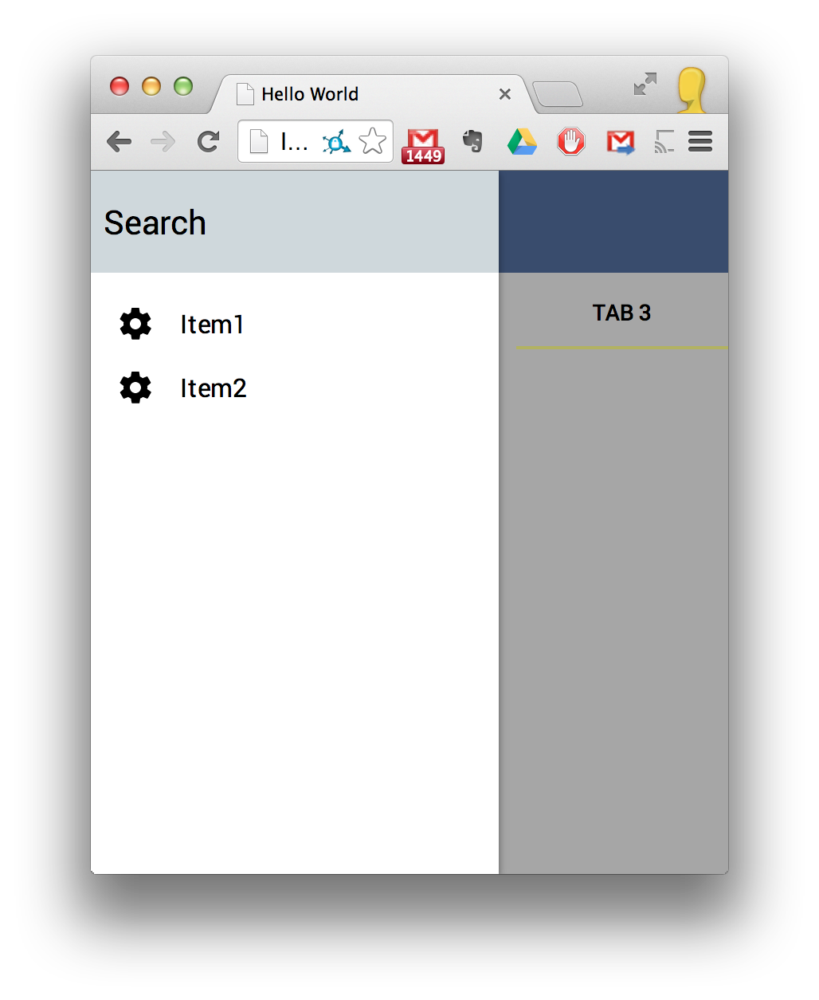

Generic Cordova Polymer Application
===================================

This is a generic app framework that can run as a standalone webpage, an android
app, or an ios app.  

Features
--------

This demo provides basic application scaffolding using polymer.

In addition to

How to use this repo
--------------------

1. Clone this repo and delete the .git directory
2. Update the application name in bower.json and package.json
3. Follow the steps below to get the boilerplate app working.

First time Setup
----------------

### Setting up tools

1. run ``npm install -g yo`` to install yo, grunt-cli and bower
2. run ``npm install -g cordova`` to install the cordova mobile utility
3. run ``export PATH=/usr/local/share/npm/bin:$PATH`` to ensure command line access to modules.

### Setting up the repo after cloning for the first time

1. run ``npm install`` to initialize node modules
2. run ``bower install`` to initialize bower dependencies
3. run ``cordova platform add ios`` to add ios platform to project
4. run ``cordova platform add android`` to add android4platform to project
5. run ``cordova build``

### Copying settings to android and ios app

Run this the first time, and any time after you make modifications to the ``www`` directory.

1. run ``cordova build`` to initialize the platforms directory with ios and android applications

Standalone web app
------------------

### Running the web application

1. grunt serve --platform=ios

Android
-------

### Running the android app

The android app can be run in an emulator, which can be installed with brew

1. run ``brew install android`` to install the android toolkig
2. run ``android`` to download packages and set up an avd device.

To run the android on an emulator or connected device

1. Attach an android device in debug mode, or run the android avd emulator.
2. if you are running on a connected device you can verify first with ``adb devices``
2. run ``cca run android``

### Debugging the android app

TODO

IOS
---

### Running the ios app

The ios app can be run in an emulator, which can be installed via xcode.  It can only be installed on devices with a valid provisioning profile, which requires a paid apple developer account.

To run on a emulator

1. run ``cca emulate ios``

To run on a connected device (requires provisioning)

1. run ``cca run ios``

### Debugging the ios app

1. Run Xcode
2. Open ``./platforms/ios/*.xcodeproj``
3. Click Run

### Debugging the ios app in safari

1. At the command line run ``defaults write com.apple.Safari IncludeDebugMenu 1`` (you only need to do this once)
2. Launch the app in the emulator
3. Launch safari
4. Connect to the Iphone Simulator in the Develop menu

Extending the application
-------------------------

### adding new javascript dependencies

1. Find a module with ``bower search <search term>``
2. Install it and save it to your bower.json file with ``bower install <javascript module> --save``

### adding new plugins

1. ``cca plugin add <plugin name``
2. ``cca pre-prepare``
3. ``cca prepare``

New javascript files may need to be (vulcanized)[http://www.polymer-project.org/articles/concatenating-web-components.html]

1. ``vulcanize -o build.html index.html --csp``

File documentation
------------------
### Project files
* **``README.md``** This file
* **``bower.json``** A list of all json dependencies.  _Do not modify directly_.  Add new dependencies with ``bower install <dependency name> --save``
* **``config.xml``** A config file for cordova.
* **``www/``** All of the actual content of the app is contained in this directory

  * **``index.html``** The skeleton of one-page application mostly just contains javascript and css imports.  Very little modifications should be made to this, other than new bower dependencies or css.
  * **``manifest.json``** Defines how the chrome app will be packaged, including identifiers, oauth behaviors, permissions, icons, and version name.
  * **``background.js``** Defines the behavior of the chrome app, including the landing page, and the window size of the chrome extension (does not affect ios or android).
  * **``assets/``** Contains icons that will be used to represent the app
  * **``bower_components/``** Contains external javascript and css dependencies brought in by bower.json.  Should not be version controlled or modified directly- make all modifications to ``../bower.json`` using ``bower install --save``
  * **``images/``** Contains all packaged images used by the application, i.e. logos.
  * **``res/``** Contains resources used by the packaged apps, such as splash screens (TBD).
  * **``scripts/``** Contains all javascript objects used by the application
  * **``styles/``** Contains custom stylesheets for the application

    * **``main.css``** Common css for the application

  * **``views/``** Contains different screens for the application

    * **``main.html``** The landing page that the user first sees

### Files not kept in version control

* ``platforms/*`` These files are generated by cca prepare
* ``plugins/*`` These files should be generated with cca plugin install as they vary by machine
* ``node_modules/*`` These files are generaetd by npm install
* ``www/bower_components/*`` These files are generated by bower install
